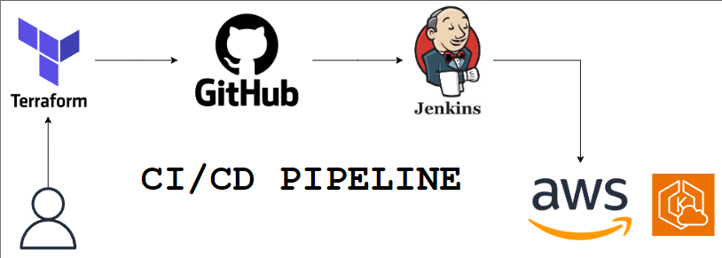

# Jenkins CI/CD for AWS Infrastructure

This project aims to demonstrate the use of Jenkins for Continuous Integration and Continuous Deployment (CI/CD) of AWS infrastructure. It includes configurations for setting up a Jenkins server on an EC2 instance, managing a remote backend for Terraform state files on AWS S3, and provisioning an AWS infrastructure (eg.EKS cluster).

## Architecture 

## Folder Structure

- **Jenkins**: Contains files to configure Jenkins CI/CD server on an EC2 instance.
- **Backend**: Contains code for configuring remote backend on AWS S3 to store Terraform state files.
- **Eks_cluster**: Contains code to provision and manage the EKS cluster.

## Features

- **Jenkins CI/CD Setup**: Automate the deployment of AWS infrastructure using Jenkins pipelines.
- **Remote Backend Configuration**: Store Terraform state files on AWS S3 for improved collaboration and versioning.
- **EKS Cluster Provisioning**: Automatically provision and manage an EKS cluster for container orchestration.

## Setup Instructions

1. **Backend Configuration**:
   - Follow the instructions in the `Backend/README.md` file to configure the remote backend on AWS S3.

2. **Jenkins Setup**:
   - Follow the instructions in the `Jenkins/README.md` file to configure Jenkins on an EC2 instance.

3. **EKS Cluster Provisioning**:
   - Follow the instructions in the `Eks_cluster/README.md` file to provision and manage the EKS cluster.

## Prerequisites

- AWS Account with appropriate permissions to create resources.
- EC2 instance for Jenkins server.
- Terraform installed locally for managing infrastructure.
- Basic knowledge of Jenkins, Terraform, and AWS services.
