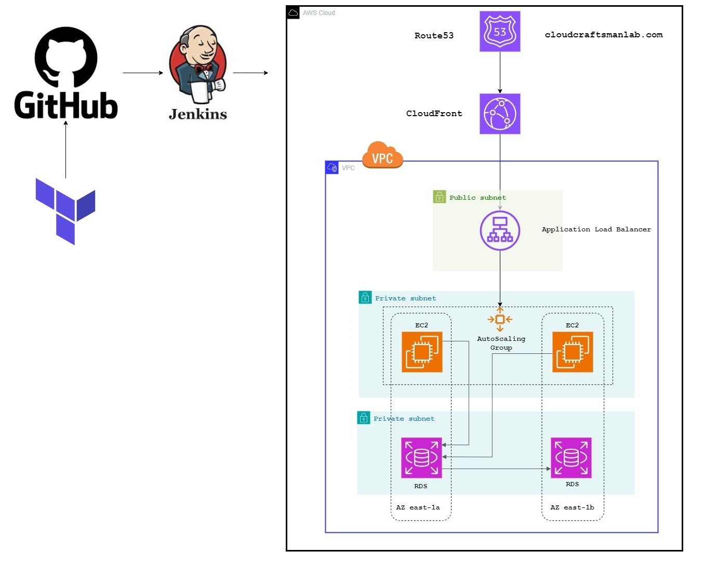

# AWS 2-Tier Application Deployment with Jenkins

This repository contains the code and configuration for deploying a 2-tier application on AWS using Jenkins. The architecture involves utilizing Route53, CloudFront, Application Load Balancer (ALB), Auto Scaling Group, RDS (Relational Database Service), with ALB in a public subnet, and EC2 & RDS in a private subnet. Additionally, an ACM (AWS Certificate Manager) certificate is used for CloudFront and Route53 for the domain 'cloudcraftsmanlab.com'.

## Architecture Diagram

## Components Used
- **Route53**: DNS web service for routing traffic to AWS resources.
- **CloudFront**: Content Delivery Network (CDN) service for fast delivery of web content.
- **Application Load Balancer (ALB)**: Distributes incoming application or network traffic across multiple targets, such as EC2 instances.
- **Auto Scaling Group**: Automatically adjusts the number of EC2 instances in response to demand or defined conditions.
- **RDS**: Managed relational database service for MySQL, PostgreSQL, SQL Server, etc.
- **ACM Certificate**: Used for securing connections to the CloudFront distribution and Route53 hosted zone.

## Setup Instructions
1. Clone this repository to your local machine.
2. Modify the configuration files according to your specific requirements.
3. Ensure you have AWS credentials configured on your local machine.
4. Create an ACM certificate for your domain 'cloudcraftsmanlab.com'.
5. Create Route53 hosted zone and configure DNS settings for your domain.
6. Deploy the CloudFront distribution with the ACM certificate.
7. Set up the Application Load Balancer and configure listener rules.
8. Launch EC2 instances in the private subnet and configure them to connect to the ALB.
9. Configure the RDS instance with the appropriate security groups and parameters.
10. Set up Jenkins for automated deployment and continuous integration.
